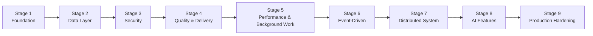
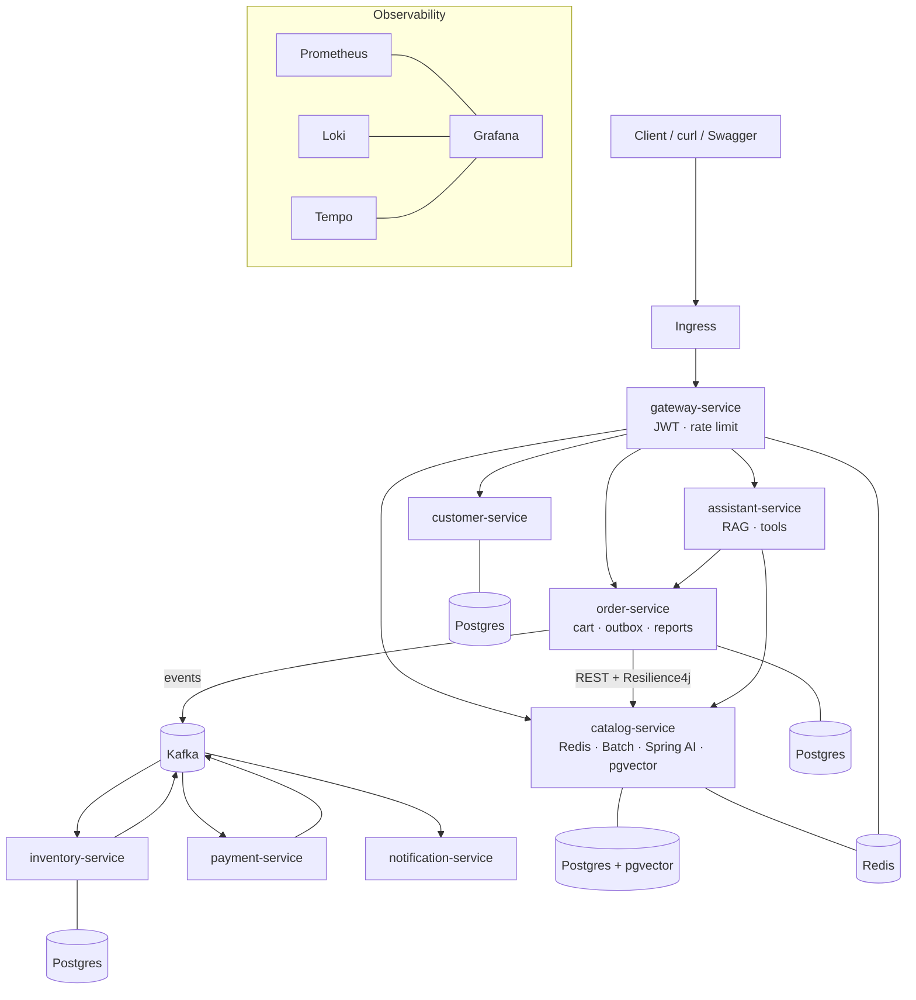

# EcomDemo: Learning Roadmap

From a simple Spring Boot monolith to a production-grade distributed system, one technology at a time.

**Purpose:** learning, not commercialization. Every phase introduces **exactly one** new technology or concept, so each one can be understood before the next arrives.

**Base stack:** Java 21 · latest stable Spring Boot 4.x · Maven

---

## How to Use This Document

1. Complete phases **in order**. Each phase assumes the previous one is done.
2. Before starting a phase, copy its section into the Claude Code prompt template (see the end of this document).
3. Work on a **dedicated Git branch** per phase (from Phase 1 onwards), merge through a Pull Request, and tag the result (`phase-05-complete`).
4. Only move on when every item in **Done when** is true **and** you can explain every item in **Concepts to understand** in your own words.
5. Update the **Progress Tracker** below after each phase.

### Ground Rules for Every Phase

- One new technology per phase. No "while we're at it" additions.
- All existing tests must still pass (`./mvnw clean verify`).
- The README gets a short section explaining what the phase added and how to run or try it.
- Record key decisions in `docs/decisions.md` (one short paragraph per decision).
- Check library versions against the Spring Boot version in use. Never add milestone or snapshot dependencies.

---

## The Journey at a Glance



---

## Progress Tracker

| Phase | Technology | Stage | Status |
|---|---|---|---|
| 0 | Baseline monolith (Spring Boot + H2) | Foundation | ✅ Complete |
| 1 | Git & GitHub workflow | Foundation | ⬜ |
| 2 | Automated testing (JUnit 5, Mockito, MockMvc) | Foundation | ⬜ |
| 3 | API documentation (OpenAPI / Swagger) | Foundation | ⬜ |
| 4 | PostgreSQL | Data | ⬜ |
| 5 | Flyway migrations | Data | ⬜ |
| 6 | Transactions & concurrency | Data | ⬜ |
| 7 | Testcontainers | Data | ⬜ |
| 8 | Spring Security (users & roles) | Security | ⬜ |
| 9 | JWT authentication | Security | ⬜ |
| 10 | Containerization (Docker & Compose) | Quality & Delivery | ⬜ |
| 11 | CI with GitHub Actions | Quality & Delivery | ⬜ |
| 12 | Code quality with SonarQube | Quality & Delivery | ⬜ |
| 13 | Redis caching | Performance | ⬜ |
| 14 | Spring Batch | Performance | ⬜ |
| 15 | Metrics (Actuator, Prometheus, Grafana) | Performance | ⬜ |
| 16 | Centralized logging (Grafana Loki) | Performance | ⬜ |
| 17 | Apache Kafka | Event-Driven | ⬜ |
| 18 | Transactional Outbox pattern | Event-Driven | ⬜ |
| 19 | Modular monolith (Spring Modulith) | Distributed | ⬜ |
| 20 | Microservices split | Distributed | ⬜ |
| 21 | API Gateway (Spring Cloud Gateway) | Distributed | ⬜ |
| 22 | Resilience (Resilience4j) | Distributed | ⬜ |
| 23 | Distributed tracing (OpenTelemetry) | Distributed | ⬜ |
| 24 | Saga pattern (distributed transactions) | Distributed | ⬜ |
| 25 | Kubernetes | Distributed | ⬜ |
| 26 | Cloud deployment (Azure AKS), optional | Distributed | ⬜ |
| 27 | Spring AI (LLM features) | AI | ⬜ |
| 28 | Semantic search (pgvector) | AI | ⬜ |
| 29 | AI shopping assistant (RAG + tool calling) | AI | ⬜ |
| 30 | Performance testing (Gatling) | Hardening | ⬜ |
| 31 | Security scanning (OWASP Dependency-Check + Trivy) | Hardening | ⬜ |

---

# Stage 1: Foundation

## Phase 0: Baseline Monolith

**Technology:** Spring Boot (Web, Data JPA, Validation) + H2 in-memory database

**Goal:** Understand how an e-commerce backend works end to end, with nothing else in the way.

**What you'll implement**
- `product` feature: CRUD (id, name, description, price, stockQuantity).
- `cart` feature: a single shared cart (no users). Add, update, and remove items, and view the cart with a server-calculated total.
- `order` feature: place an order from the cart (check stock, reduce stock, save order, empty cart), list orders, and get an order by id.
- `common` package: one `@RestControllerAdvice` returning `{ status, message }` for 404, 400, and 409.
- Seed about 10 products through `data.sql`. H2 console at `/h2-console`.
- Layering: Controller → Service → Repository, with DTOs as Java records.

**Concepts to understand**
- Spring Boot auto-configuration and starters
- The role of each layer (controller, service, repository)
- JPA entities, relationships (`@OneToMany`, `@ManyToOne`), and lazy vs eager loading
- Why entities are never returned from controllers
- Bean Validation (`@NotBlank`, `@Positive`, `@Valid`)
- Why `BigDecimal` is used for money

**Done when**
- The app starts with `./mvnw spring-boot:run`.
- The full curl flow works: list products → add to cart → view cart → place order → view order → stock decreased.
- One `@SpringBootTest` verifies the place-order flow.

**Not in this phase:** security, real database, Docker, extra tests.

---

## Phase 1: Git & GitHub Workflow

**Technology:** Git + GitHub

**Goal:** Put the project under professional version control, so every later phase follows a real team workflow.

**What you'll implement**
- Initialize the repository, add a proper `.gitignore` (Maven, IDE files, `.env`), and push to a new GitHub repository.
- Branching strategy: `main` (always working) plus `feature/phase-XX-<name>` branches.
- Conventional Commits (`feat:`, `fix:`, `test:`, `docs:`, `chore:`).
- A Pull Request template (`.github/pull_request_template.md`) with what changed, how it was tested, and a checklist.
- `CLAUDE.md` at the repository root describing project conventions, build commands, and a pointer to this roadmap (store the roadmap at `docs/ROADMAP.md`).
- Tag `phase-00-complete` on the baseline commit.

**Concepts to understand**
- Branching, merging, and rebasing, and when to use each
- Pull Requests and code review flow
- Semantic commit messages and why teams use them
- Tags and releases
- Branch protection rules (configured in the GitHub UI)

**Done when**
- The repository is on GitHub, `main` is protected, and Phase 1 itself was merged through a PR.

**Not in this phase:** CI pipelines (Phase 11).

---

## Phase 2: Automated Testing

**Technology:** JUnit 5 + Mockito + Spring test slices (MockMvc)

**Goal:** Build a safety net, so every future phase can change code with confidence.

**What you'll implement**
- Unit tests for every service class, with repositories mocked through Mockito.
- `@WebMvcTest` controller tests using MockMvc (status codes, JSON body, validation errors).
- `@DataJpaTest` repository tests for any custom queries.
- Test naming convention: `methodName_condition_expectedResult`.
- AssertJ for readable assertions.

**Concepts to understand**
- The test pyramid: unit vs slice vs integration tests
- Mocks vs stubs vs spies
- What `@WebMvcTest`, `@DataJpaTest`, and `@SpringBootTest` each load
- Given / When / Then structure

**Done when**
- Every service method has tests covering the success path and at least one failure path.
- `./mvnw clean verify` passes.

**Not in this phase:** coverage reporting (Phase 12), real-database tests (Phase 7).

---

## Phase 3: API Documentation

**Technology:** springdoc-openapi (OpenAPI 3 / Swagger UI)

**Goal:** Make the API self-documenting and explorable in a browser.

**What you'll implement**
- Add springdoc-openapi (the version compatible with your Spring Boot version).
- Swagger UI at `/swagger-ui.html` and the OpenAPI JSON at `/v3/api-docs`.
- Annotate controllers with `@Tag`, `@Operation`, and `@ApiResponse`. Add `@Schema` examples on DTOs.
- Document error responses.

**Concepts to understand**
- The OpenAPI specification and why it matters (client generation, contract-first vs code-first)
- How documentation stays in sync with code

**Done when**
- Every endpoint is visible and callable from Swagger UI, with descriptions and examples.

---

# Stage 2: Data Layer

## Phase 4: PostgreSQL

**Technology:** PostgreSQL

**Goal:** Move from an in-memory database to a real relational database.

**What you'll implement**
- Replace H2 with the PostgreSQL driver.
- Run PostgreSQL locally, either as a native installation or with a single `docker run` command provided in the README. Docker itself is studied in Phase 10.
- Spring profiles: `application-dev.properties` (PostgreSQL) and `application-test.properties`.
- Credentials read from environment variables, with local defaults in the dev profile.
- Keep `ddl-auto=update` for now (replaced in Phase 5).

**Concepts to understand**
- Spring profiles and externalized configuration
- Connection pooling (HikariCP) and its key settings
- Differences between H2 and PostgreSQL (types, sequences, case sensitivity)
- Connecting with a DB client (DBeaver or pgAdmin) and reading the generated schema

**Done when**
- Data survives an application restart, and all tests pass.

---

## Phase 5: Database Migrations

**Technology:** Flyway

**Goal:** Version-control the database schema like code.

**What you'll implement**
- `V1__init_schema.sql` (tables, constraints, indexes).
- `V2__seed_products.sql` (replaces `data.sql`).
- Switch to `spring.jpa.hibernate.ddl-auto=validate`.
- Add one realistic change as `V3__add_product_category.sql` (a `category` column plus an index) to experience schema evolution.

**Concepts to understand**
- Why `ddl-auto=update` is dangerous in production
- Versioned vs repeatable migrations
- The `flyway_schema_history` table and checksums
- Why you never edit an applied migration
- Backward-compatible schema changes

**Done when**
- A fresh database is fully built by Flyway, and Hibernate validation passes on startup.

---

## Phase 6: Transactions & Concurrency

**Technology:** Spring transaction management (`@Transactional`) + JPA optimistic locking

**Goal:** Guarantee data correctness when things fail or happen at the same time.

**What you'll implement**
- Make "place order" fully atomic: if any item has insufficient stock, nothing is saved and no stock changes.
- `@Transactional(readOnly = true)` on read services.
- `@Version` on `Product` for optimistic locking. Handle `OptimisticLockingFailureException` with a limited retry (Spring Retry or a simple loop) and a 409 response.
- An `order_audit` table written with `Propagation.REQUIRES_NEW`, so audit entries survive a rollback of the main transaction.
- A concurrency test: two threads try to buy the last unit, and exactly one succeeds.

**Concepts to understand**
- ACID properties
- Propagation types (`REQUIRED`, `REQUIRES_NEW`, `MANDATORY`)
- Isolation levels and the anomalies each prevents (dirty read, non-repeatable read, phantom read, lost update)
- Rollback rules (checked vs unchecked exceptions)
- The self-invocation pitfall (proxy-based transactions)
- Optimistic vs pessimistic locking (`@Lock(PESSIMISTIC_WRITE)`), and when to use each

**Done when**
- The concurrency test passes reliably, and a failed order leaves no partial data.

---

## Phase 7: Integration Testing with Real Infrastructure

**Technology:** Testcontainers

**Goal:** Test against real PostgreSQL instead of mocks or H2.

**What you'll implement**
- Testcontainers PostgreSQL module with `@ServiceConnection`.
- One integration test per feature: product CRUD, cart flow, and full order flow through HTTP (`TestRestTemplate` or `RestClient`).
- A shared base test configuration so containers are reused across tests.
- Separate unit tests (Surefire) from integration tests (Failsafe, `*IT.java`).

**Concepts to understand**
- Why "works on H2" does not mean "works on PostgreSQL"
- Container lifecycle and reuse
- Surefire vs Failsafe

**Done when**
- `./mvnw verify` runs unit and integration tests. Docker is required only as a runtime for tests.

---

# Stage 3: Security

## Phase 8: Spring Security (Users & Roles)

**Technology:** Spring Security

**Goal:** Introduce real users, authentication, and authorization.

**What you'll implement**
- `customer` feature: register (with a BCrypt-hashed password), profile, and a `users` table (Flyway migration).
- Roles: `CUSTOMER` and `ADMIN`. The admin user is seeded by a migration.
- HTTP Basic authentication for now.
- Authorization rules: product reads are public; product writes require ADMIN; cart and orders require CUSTOMER.
- **Cart per user** (replaces the shared cart). Orders belong to the logged-in user.
- Method security (`@PreAuthorize`) so users can only see their own orders.
- 401 and 403 responses in the standard error format.

**Concepts to understand**
- The security filter chain
- Authentication vs authorization
- `UserDetailsService` and `PasswordEncoder`
- Why passwords are hashed, not encrypted
- CSRF and why it is disabled for stateless APIs

**Done when**
- Security tests (`@WithMockUser`) cover allowed and denied access for each role.

---

## Phase 9: Stateless Authentication with JWT

**Technology:** JWT (Spring Security OAuth2 Resource Server)

**Goal:** Replace HTTP Basic with token-based authentication, as used by real APIs.

**What you'll implement**
- `POST /api/auth/login` returns a signed JWT (with roles as claims and a short expiry).
- Resource Server configuration validates the token on every request.
- The signing key comes from an environment variable.
- Swagger UI configured to accept a Bearer token.
- Optional: a refresh-token endpoint.

**Concepts to understand**
- JWT structure (header, payload, signature)
- Stateless vs session-based authentication
- Symmetric (HMAC) vs asymmetric (RSA) signing
- Token expiry, refresh tokens, and revocation trade-offs
- What OAuth2 and OIDC add on top (the conceptual basis for Keycloak or Entra ID)

**Done when**
- All secured endpoints work with a Bearer token, and expired or tampered tokens are rejected.

---

# Stage 4: Quality & Delivery

## Phase 10: Containerization

**Technology:** Docker + Docker Compose

**Goal:** Package the application so it runs identically everywhere.

**What you'll implement**
- A multi-stage `Dockerfile`: a build stage with Maven and a runtime stage with a slim JRE 21. The container runs as a non-root user and uses Spring Boot's layered JAR.
- `compose.yaml` with the app and PostgreSQL, including health checks, named volumes, and environment variables.
- A `.env.example` file (and `.env` in `.gitignore`).
- JVM container settings (`-XX:MaxRAMPercentage`).
- A comparison with Cloud Native Buildpacks (`./mvnw spring-boot:build-image`), documented in `docs/decisions.md`.

**Concepts to understand**
- Images vs containers, and layers with their caching
- Multi-stage builds and image size
- Container networking (why the app uses `postgres`, not `localhost`)
- Volumes and data persistence
- Why containers should not run as root

**Done when**
- `docker compose up` starts the whole system, and the curl flow works against the container.

---

## Phase 11: Continuous Integration

**Technology:** GitHub Actions

**Goal:** Automatically build and test every change.

**What you'll implement**
- A `ci.yml` workflow on every PR: checkout, set up Java 21 with Maven cache, run `./mvnw verify` (Testcontainers works on GitHub runners).
- On merge to `main`: build the Docker image and push it to GitHub Container Registry (GHCR), tagged with the commit SHA and `latest`.
- Branch protection: a PR cannot merge unless CI passes.
- Upload test reports as workflow artifacts.
- Dependabot configuration for Maven and GitHub Actions updates.

**Concepts to understand**
- CI vs CD
- Workflows, jobs, steps, triggers, and runners
- Secrets and `GITHUB_TOKEN` permissions
- Caching dependencies
- Image tagging strategies

**Done when**
- A failing test blocks a PR, and a merge to `main` publishes an image.

---

## Phase 12: Code Quality

**Technology:** SonarQube (+ JaCoCo for coverage)

**Goal:** Measure and enforce code quality objectively.

**What you'll implement**
- Run SonarQube Community Edition locally through Docker Compose (a separate `compose.sonar.yaml`).
- The JaCoCo Maven plugin generates coverage reports.
- Analyze with `./mvnw sonar:sonar`.
- Fix reported bugs, code smells, and security hotspots.
- Define a quality gate (for example, at least 70% coverage on new code and no new critical issues).
- Optional: SonarQube Cloud (free for public repositories) integrated into the GitHub Actions workflow with PR decoration.

**Concepts to understand**
- Bugs vs vulnerabilities vs code smells vs security hotspots
- Cyclomatic and cognitive complexity
- Technical debt
- Quality gates, and why "new code" metrics matter
- Why coverage alone does not prove good tests

**Done when**
- The project passes the quality gate, and results are documented in the README.

---

# Stage 5: Performance & Background Work

## Phase 13: Caching

**Technology:** Redis

**Goal:** Reduce database load and speed up frequent reads.

**What you'll implement**
- Add Redis to `compose.yaml`.
- Spring Cache abstraction with Redis: `@Cacheable` on get-product-by-id and product list, and `@CacheEvict` / `@CachePut` on product updates and deletes.
- JSON serialization (not Java serialization), with a TTL per cache.
- Log cache hits and misses to observe the behaviour.
- Testcontainers Redis for the integration test.

**Concepts to understand**
- Cache-aside pattern
- Cache invalidation strategies and stale data risks
- TTL and eviction policies
- Redis data types (string, hash, list, set, sorted set)
- What should **not** be cached (stock levels during checkout)

**Done when**
- A second product fetch does not hit the database (verified by SQL logs), and updates invalidate the cache.

---

## Phase 14: Batch Processing

**Technology:** Spring Batch

**Goal:** Process large data volumes reliably in the background.

**What you'll implement**
- **Job 1, product import:** read a CSV of products, validate, and upsert into the database. The job is chunk-oriented (for example, chunk size 100), skips invalid rows with a skip limit, and writes skipped rows to an error file.
- **Job 2, daily sales report:** read the previous day's orders and write a CSV summary (orders count, revenue, top products).
- The Batch JobRepository schema lives in PostgreSQL (through Flyway).
- Trigger Job 1 through an ADMIN endpoint (file upload) and Job 2 through `@Scheduled` (cron), both with job parameters.
- A restartability demo: fail mid-job, restart, and continue from the last committed chunk.

**Concepts to understand**
- Job, Step, ItemReader, ItemProcessor, and ItemWriter
- Chunk-oriented vs tasklet steps
- JobInstance vs JobExecution and job parameters
- Skip, retry, and restart semantics
- Transaction boundaries per chunk

**Done when**
- Importing a 10,000-row CSV works with some invalid rows skipped, and the report file is generated on schedule.

---

## Phase 15: Metrics & Monitoring

**Technology:** Spring Boot Actuator + Micrometer + Prometheus + Grafana

**Goal:** See what the application is doing in real time.

**What you'll implement**
- Actuator endpoints: health (with liveness and readiness groups), info, metrics, and prometheus. Only these are exposed.
- Custom business metrics: `orders.placed` counter, `order.value` distribution summary, and a timer on checkout.
- Prometheus and Grafana in Compose, with a provisioned dashboard (JVM, HTTP latency, error rate, business metrics).
- One alert rule (for example, error rate above 5%).

**Concepts to understand**
- Metrics types: counter, gauge, timer, distribution summary
- The pull-based scraping model
- The RED and USE methods
- Liveness vs readiness probes (needed for Phase 25)

**Done when**
- The Grafana dashboard shows live traffic and business metrics while you run the curl flow.

---

## Phase 16: Centralized Logging

**Technology:** Grafana Loki (with structured JSON logging)

**Goal:** Search and correlate logs in one place.

**What you'll implement**
- Structured JSON console logging (Spring Boot's built-in structured logging support).
- A correlation ID per request (a filter plus MDC) included in every log line and returned in a response header.
- Loki and a log shipper (Grafana Alloy) in Compose, with Loki added as a Grafana data source.
- Consistent log levels and messages (no sensitive data such as passwords or tokens).

**Concepts to understand**
- Why structured logs beat plain text
- MDC (Mapped Diagnostic Context)
- Log levels and what belongs in each
- Log aggregation architecture (and how ELK compares)

**Done when**
- You can find all logs for one order request in Grafana using its correlation ID.

---

# Stage 6: Event-Driven Architecture

## Phase 17: Messaging

**Technology:** Apache Kafka (KRaft mode, no ZooKeeper)

**Goal:** Learn asynchronous, event-driven communication. The app is still a monolith, so the focus stays on Kafka alone.

**What you'll implement**
- Kafka in Compose (single broker, KRaft), plus a UI tool (Kafka UI) for inspection.
- Publish an `OrderPlacedEvent` (JSON) to topic `orders.placed` after checkout. The order id is the message key.
- A `notification` package with a consumer that "sends" a confirmation by writing a log line and a `notifications` table row.
- Error handling: a retry topic with backoff and a dead-letter topic (`DefaultErrorHandler` or `@RetryableTopic`).
- An idempotent consumer: a `processed_events` table prevents duplicate handling.
- Testcontainers Kafka integration test.

**Concepts to understand**
- Topics, partitions, offsets, and replication
- Producers, consumers, and consumer groups
- Message keys and ordering guarantees
- Delivery semantics (at-most-once, at-least-once, exactly-once)
- Why consumers must be idempotent
- Dead-letter topics

**Done when**
- Placing an order produces an event, the notification is recorded once, and a poison message lands in the DLT.

---

## Phase 18: Reliable Event Publishing

**Technology:** Transactional Outbox pattern

**Goal:** Solve the dual-write problem between the database and Kafka.

**What you'll implement**
- An `outbox_events` table (Flyway).
- Checkout saves the order **and** an outbox row in the same database transaction. Kafka is not called directly anymore.
- A scheduled outbox relay reads unpublished rows, publishes them to Kafka, and marks them as sent.
- A demo: stop Kafka, place orders, restart Kafka, and watch the events still get delivered.
- A cleanup job for old sent events.

**Concepts to understand**
- The dual-write problem, and why `@Transactional` cannot cover both the database and Kafka
- The outbox pattern vs Change Data Capture (Debezium), conceptually
- Ordering and duplicate delivery trade-offs

**Done when**
- No order event is lost while Kafka is down.

---

# Stage 7: Distributed System

## Phase 19: Modular Monolith

**Technology:** Spring Modulith

**Goal:** Enforce clean module boundaries **before** splitting into services. This is the rehearsal for microservices.

**What you'll implement**
- Restructure into modules: `catalog`, `inventory` (stock extracted from product), `customer`, `cart`, `order`, `notification`, and `shared`.
- Each module exposes a small public API, with everything else in `internal`.
- Replace direct cross-module calls with application events where appropriate.
- A test with `ApplicationModules.verify()`, plus generated module documentation diagrams.

**Concepts to understand**
- Bounded contexts (DDD basics)
- Coupling and cohesion
- Why "microservices first" is usually a mistake
- Synchronous calls vs events between modules

**Done when**
- The module verification test passes, and the diagrams show clear dependencies.

---

## Phase 20: Microservices Split

**Technology:** Multi-service architecture (Maven multi-module repository, database per service)

**Goal:** Turn the modules into independently deployable services.

**What you'll implement**
- Services: `catalog-service` (products + Redis + batch import), `inventory-service` (stock), `order-service` (cart + orders + outbox + sales report), `customer-service` (users + JWT issuing), and `notification-service` (Kafka consumer).
- One PostgreSQL database (or schema) per service, each with its own Flyway migrations.
- Synchronous calls through Spring `RestClient` / HTTP Interface clients (for example, order → catalog for prices).
- Asynchronous communication through Kafka (already in place).
- Every service validates JWTs independently.
- `compose.yaml` runs all services.

**Concepts to understand**
- Database-per-service and its consequences (no joins, no cross-service transactions)
- Synchronous vs asynchronous communication trade-offs
- Data duplication and eventual consistency
- Service contracts and versioning

**Done when**
- The full purchase flow works across services through Compose.

---

## Phase 21: API Gateway

**Technology:** Spring Cloud Gateway

**Goal:** Give clients a single entry point.

**What you'll implement**
- A `gateway-service` that routes `/api/products/**`, `/api/orders/**`, and the other paths to their services.
- JWT validation at the gateway, forwarding user info through headers.
- Rate limiting with the Redis-based request rate limiter.
- CORS configuration and a global request logging filter (propagating the correlation ID).
- Use the Spring Cloud release train compatible with your Spring Boot version.

**Concepts to understand**
- API gateway responsibilities (routing, auth, rate limiting, aggregation)
- Filters and predicates
- Gateway vs load balancer vs service mesh

**Done when**
- Clients only talk to the gateway, and rate limits return 429.

---

## Phase 22: Resilience

**Technology:** Resilience4j

**Goal:** Keep the system working when a dependency is slow or down.

**What you'll implement**
- Circuit breaker, retry, and timeout on order-service → catalog-service calls.
- Fallback behaviour (for example, a clear 503 with a helpful message).
- A bulkhead on a critical call.
- Resilience metrics exposed to Prometheus, with a circuit breaker panel in Grafana.
- A demo: stop catalog-service and observe the circuit opening and closing.

**Concepts to understand**
- Cascading failures
- Circuit breaker states (closed, open, half-open)
- Retry with backoff and jitter, and the danger of retry storms
- Timeouts as the first line of defence
- Bulkheads

**Done when**
- Killing a downstream service degrades gracefully instead of hanging the system.

---

## Phase 23: Distributed Tracing

**Technology:** Micrometer Tracing + OpenTelemetry (Grafana Tempo as the backend)

**Goal:** Follow one request across all services.

**What you'll implement**
- Tracing enabled in all services, with trace context propagated over HTTP **and** Kafka.
- Grafana Tempo in Compose.
- Trace IDs included in logs, so you can jump from a log line in Loki to the trace in Tempo.
- A sampling configuration.

**Concepts to understand**
- Traces, spans, and context propagation (W3C Trace Context)
- Sampling strategies
- The three pillars of observability: metrics, logs, and traces

**Done when**
- One checkout request shows as a single trace spanning the gateway, order, catalog, inventory, and notification services.

---

## Phase 24: Distributed Transactions

**Technology:** Saga pattern (choreography over Kafka)

**Goal:** Keep data consistent across services without distributed database transactions.

**What you'll implement**
- A new `payment-service` (mock gateway that succeeds or fails based on configuration or amount).
- The checkout flow becomes a saga:
  1. order-service creates the order as `PENDING` and emits `OrderCreated`.
  2. inventory-service reserves stock and emits `StockReserved` or `StockRejected`.
  3. payment-service charges and emits `PaymentCompleted` or `PaymentFailed`.
  4. order-service marks the order `CONFIRMED` or `CANCELLED`.
- Compensation: when payment fails, inventory releases the reserved stock.
- All publishers use the outbox pattern, and all consumers are idempotent.
- An order status endpoint so clients can poll.
- Document an orchestration-based alternative in `docs/decisions.md`.

**Concepts to understand**
- Why two-phase commit (2PC) is avoided in microservices
- Choreography vs orchestration
- Compensating transactions
- Eventual consistency from the user's perspective
- Semantic locks (the `PENDING` state)

**Done when**
- Success and payment-failure scenarios both end in consistent data across all services, verified by an end-to-end test.

---

## Phase 25: Container Orchestration

**Technology:** Kubernetes (local cluster with kind or minikube)

**Goal:** Run the distributed system the way production does.

**What you'll implement**
- Manifests per service: Deployment, Service, ConfigMap, and Secret.
- Liveness and readiness probes using the Actuator health groups from Phase 15.
- Resource requests and limits.
- An Ingress in front of the gateway.
- Infrastructure (PostgreSQL, Kafka, Redis) installed through Helm charts or simple manifests. The goal is learning, not operating them.
- A Horizontal Pod Autoscaler on one service.
- A demo: rolling update with zero downtime, and killing a pod to watch self-healing.

**Concepts to understand**
- Pods, Deployments, ReplicaSets, and Services
- ConfigMaps vs Secrets
- Probes and the pod lifecycle
- Rolling updates and rollbacks
- Horizontal scaling and why services must be stateless

**Done when**
- The full purchase flow works through the Ingress on the local cluster.

---

## Phase 26: Cloud Deployment (Optional)

**Technology:** Azure Kubernetes Service (AKS) + Azure Container Registry

**Goal:** Deploy to a real cloud cluster.

**What you'll implement**
- Push images to ACR from GitHub Actions (continuous delivery).
- Deploy the manifests or Helm charts to AKS.
- Use managed services where sensible (Azure Database for PostgreSQL, Azure Cache for Redis).
- Secrets from Azure Key Vault.
- **Tear everything down afterwards** to avoid costs.

**Concepts to understand**
- Managed vs self-hosted infrastructure trade-offs
- Workload identity and secrets management
- CD pipelines and environment promotion

**Done when**
- The system runs on AKS through a pipeline, and the teardown steps are documented.

---

# Stage 8: AI Features

## Phase 27: LLM Integration

**Technology:** Spring AI

**Goal:** Add generative AI features in an enterprise-friendly way.

**What you'll implement**
- Spring AI in catalog-service, using a Spring AI version compatible with your Spring Boot version.
- An ADMIN endpoint that generates product descriptions from name, category, and attributes.
- Structured output: the model returns JSON mapped to a Java record (description, tags, SEO title).
- Prompt templates stored as resource files.
- Configurable provider (OpenAI, Anthropic, Azure OpenAI, or a local model through Ollama), with the API key from the environment.
- Timeouts, error handling, and token usage metrics.

**Concepts to understand**
- Chat models, prompts, and system vs user messages
- Temperature and determinism
- Structured output and why it matters for integration
- Cost, latency, and rate limits
- Prompt injection risks

**Done when**
- Generated descriptions are saved to products, and failures degrade gracefully.

---

## Phase 28: Semantic Search

**Technology:** Vector search with pgvector (Spring AI VectorStore)

**Goal:** Search products by meaning, not just keywords.

**What you'll implement**
- Enable the pgvector extension in the catalog database (Flyway).
- Generate embeddings for products on create and update (through a Kafka event or the outbox, reusing earlier phases), plus a Spring Batch job to backfill existing products.
- A `GET /api/products/search?q=...` endpoint using similarity search (for example, "something warm for winter").
- Combine the vector search with metadata filters (category, price range).

**Concepts to understand**
- Embeddings and vector similarity (cosine distance)
- Vector indexes (HNSW) and their trade-offs
- Semantic vs keyword vs hybrid search
- Keeping embeddings in sync with source data

**Done when**
- Natural-language queries return relevant products that keyword search would miss.

---

## Phase 29: AI Shopping Assistant

**Technology:** RAG (Retrieval-Augmented Generation) + tool calling with Spring AI

**Goal:** Build a conversational assistant grounded in real store data.

**What you'll implement**
- A new `assistant-service` (or a module in the gateway layer) with `POST /api/assistant/chat`.
- RAG over the product catalog (the vector store from Phase 28) plus store policy documents (shipping and returns, ingested from Markdown).
- Tool calling: the model can call `searchProducts`, `getOrderStatus` (for the authenticated user only), and `addToCart`.
- Conversation memory per user (stored in Redis).
- Guardrails: the assistant only answers store-related questions, never exposes other users' data, and asks for confirmation before adding to cart.
- An evaluation test set of about 10 questions with expected behaviour.

**Concepts to understand**
- RAG architecture (ingest, chunk, embed, retrieve, generate)
- Tool/function calling and authorization boundaries
- Conversation memory strategies
- Hallucination and grounding
- Evaluating LLM features

**Done when**
- The assistant answers product and policy questions accurately, checks order status only for the logged-in user, and passes the evaluation set.

---

# Stage 9: Production Hardening

## Phase 30: Performance Testing

**Technology:** Gatling (Java DSL)

**Goal:** Know how the system behaves under load, and find its bottlenecks.

**What you'll implement**
- Simulations: browse products (read-heavy), full checkout (write-heavy), and a mixed realistic scenario.
- Load profiles: ramp-up, steady state, and spike.
- Compare results with and without Redis caching, and with different connection pool sizes.
- Watch the Grafana dashboards during the tests, and document findings.

**Concepts to understand**
- Throughput, latency percentiles (p50, p95, p99), and error rate
- Load vs stress vs spike vs soak tests
- Identifying bottlenecks (DB pool, threads, GC)
- Virtual threads (Java 21) and their effect on throughput

**Done when**
- A performance report exists in `docs/performance.md` with at least one bottleneck found and fixed.

---

## Phase 31: Security Scanning

**Technology:** OWASP Dependency-Check + Trivy

**Goal:** Catch vulnerable dependencies and insecure images before they ship.

**What you'll implement**
- OWASP Dependency-Check (Maven plugin) in CI, failing the build on high-severity CVEs.
- Trivy scans of the Docker images in CI.
- Fix or document every finding (suppression file with justification).
- A review against the OWASP Top 10 for APIs, with results in `docs/security.md`.

**Concepts to understand**
- CVEs and CVSS scoring
- Software supply-chain security and SBOMs
- Shift-left security
- The OWASP API Security Top 10

**Done when**
- The CI pipeline blocks vulnerable builds, and the security document is complete.

---

# Appendix A: Claude Code Prompt Template (per phase)

Copy this template, paste the phase section where indicated, and give it to Claude Code.

```
## Role
You are a senior Java and Spring Boot engineer and a patient technical mentor. You write clean, idiomatic Java 21 code and explain the "why" behind every decision.

## Context
Project: EcomDemo, a learning project that evolves an e-commerce app from a simple monolith to a production-grade distributed system, one technology per phase. The full roadmap is in docs/ROADMAP.md, and project conventions are in CLAUDE.md. Read both before starting. All previous phases are complete and merged into main.

## Task
Implement ONLY the phase below. Do not implement anything from later phases.

<PASTE THE FULL PHASE SECTION HERE>

Steps:
1. Create branch feature/phase-XX-<short-name> from main.
2. Show me a short implementation plan (files to add/change, dependencies, config) and WAIT for my approval.
3. Implement in small, logical commits using Conventional Commits.
4. Run ./mvnw clean verify and fix all failures.
5. Update the README (what this phase added, how to run and try it), docs/decisions.md, and the Progress Tracker in docs/ROADMAP.md.

## Output Format
At the end, report:
- Files created/changed (as a tree)
- New dependencies and why each is needed
- New endpoints or configuration
- Commands to run and verify the phase
- A "Concepts to understand" explanation: 2–4 sentences per concept listed in the phase, tied to the code you wrote
- Every "Done when" item, marked with how it was verified

## Constraints
- Introduce only the technology named in this phase.
- Use stable, GA versions compatible with the project's Spring Boot version. If a compatibility conflict exists, stop and explain instead of downgrading silently.
- Keep all existing tests passing, and add tests for new behaviour.
- No secrets in source control.
- If you believe something outside this phase is needed, list it as a suggestion. Do not implement it.

## Tone
Clear, precise, and educational. Explain trade-offs briefly. No filler.
```

---

# Appendix B: Final Target Architecture (after Phase 29)


